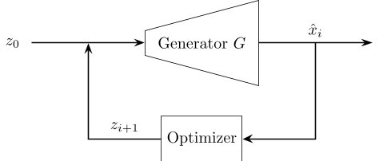
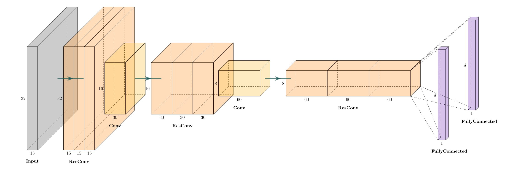
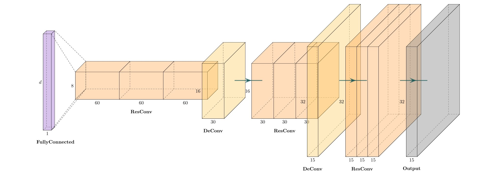
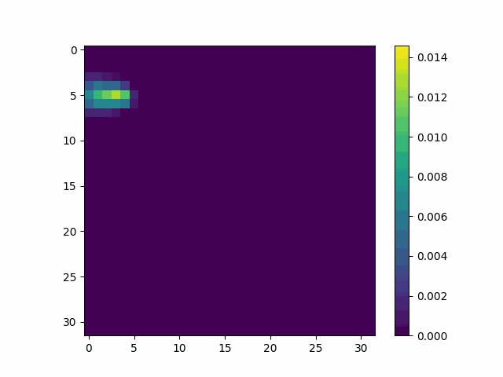
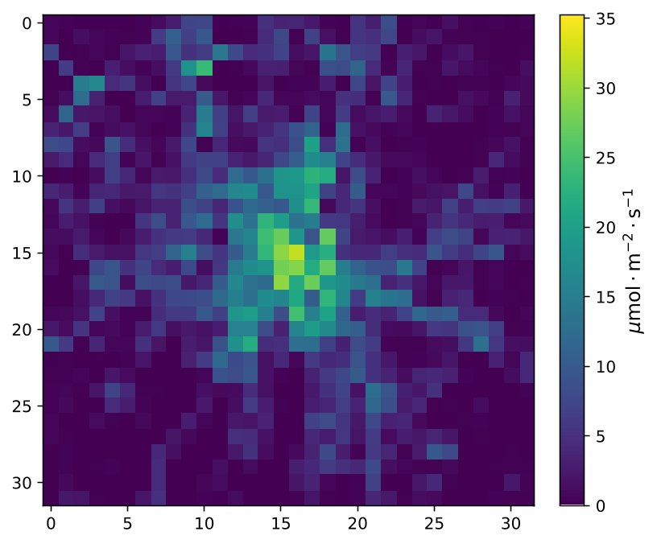
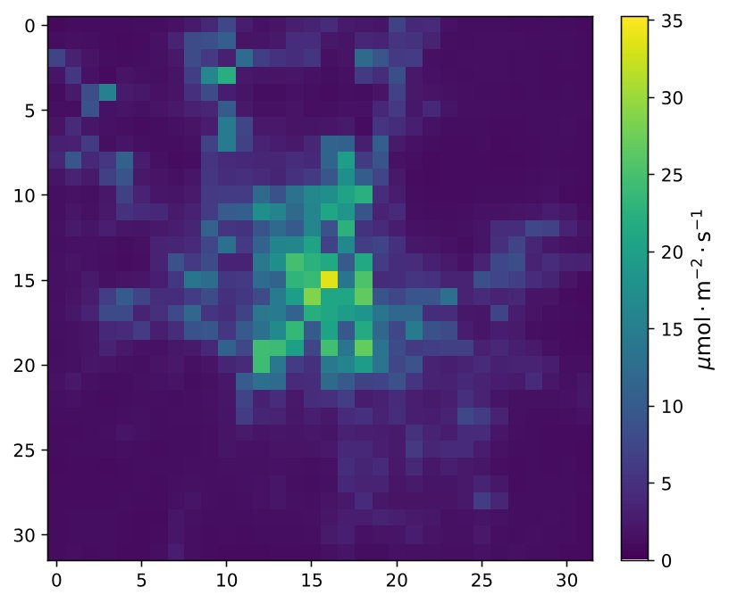
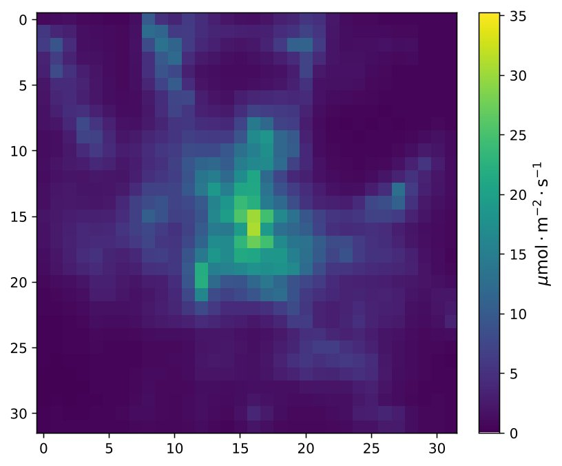
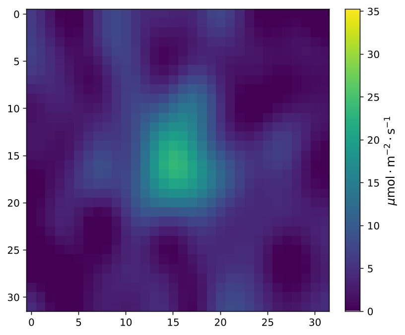
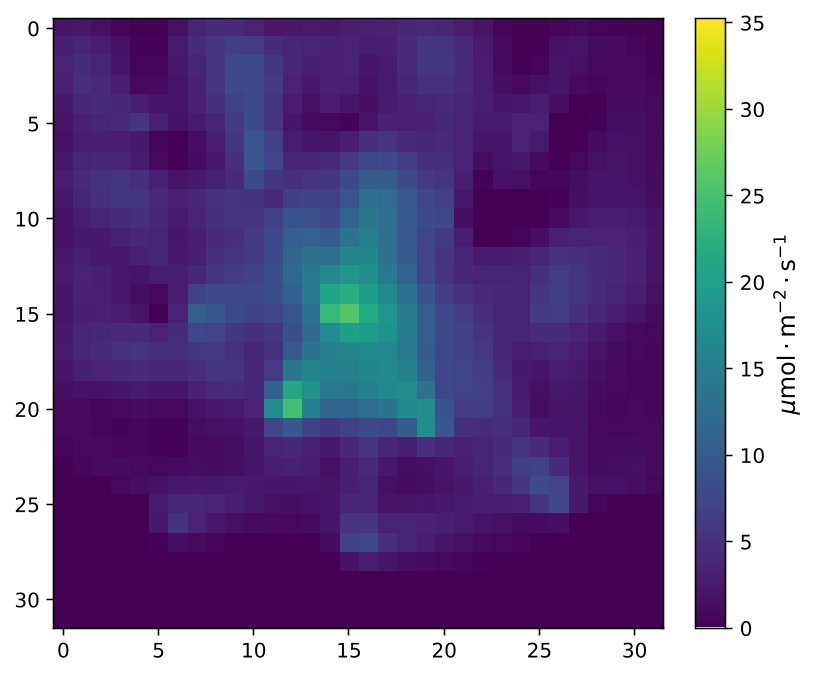

# Project
This repository provides the code accompanying the thesis, "*Learning Compressed Representations of Emission Inventories in Urban Environments.*" 

## Table of Contents
- [Method](#method)
- [Results](#results)
- [Installation](#installation)
- [Usage](#usage)
- [Development](#development)

## Method
###
A variational autoencoder (VAE) is trained to generate urban emission flux fields.
The dataset is derived from the *TNO-GHGco-v1.1* (2015) and *TNO-GHGco-v4* (2018) high resolution inventories by extracting individual cities with a population size of greater than 100,000 citizens.

This generator is then used to generate solutions to an inverse problem using a latent space optimization based on stochastic gradient descent.



The inverse problem is the following:

Based on measurements and the atmospheric transport of molecules, derive a emission flux field that best represents these measurements. 

### Architecture of the VAE:

Encoder of the VAE


Decoder of the VAE (Generator Function G)

## Results
The following section shows a reconstruction example for Munich emission fluxes.
50 Measurements are taken at 13 sensor locations with a signal to noise (SNR) ratio of 20dB.
The atmospheric transport is simulated using a Gaussian plume simulation (advection diffusion equation).



### Target
The emission flux field of Munich from 2018 looks as follows:



### Reconstructions

<table>
  <tr>
    <td>
      
      <p align="center">VAE</p>
    </td>
    <td>
      
      <p align="center">VAE (Fine-tuned)</p>
    </td>
  </tr>
  <tr>
    <td>
      
      <p align="center">Sparse Reconstruction (DCT)</p>
    </td>
    <td>
      
      <p align="center">Regularized Least Squares</p>
    </td>
  </tr>
</table>


## Installation
```bash
poetry install
```

## Usage
> **Note:**  
> The `poetry run` prefix is not required if the virtual environment is already activated using `poetry shell`.

### Preprocessing of TNO Data (Creation of Dataset)
```bash
poetry run preprocess-tno [-h] [-gw W] [-gh H] [-p N] [-v]
```

### Training of VAE
```bash
poetry run train-vae [-h] [-e N] [-d N] [-v p] [-t p] [-wandb]
```

### Fine-tuning of VAE
```bash
poetry run finetune-vae [-h] [-e N] -c C -b M
```

### Jupyter
Jupyter Notebook
```bash
poetry run jupyter-notebook
```
Jupyter Lab
```bash
poetry run jupyter-lab
```
### Scripts
There are some scripts in this repository.
Notably, in `src/experiments`, some experiments are located.
A script with name `<script>` can be run as follows:
```bash
poetry run python src/experiments/<script> <args>
```

## Development

### Installation of pre-commit hooks
```bash
poetry run pre-commit install
```


